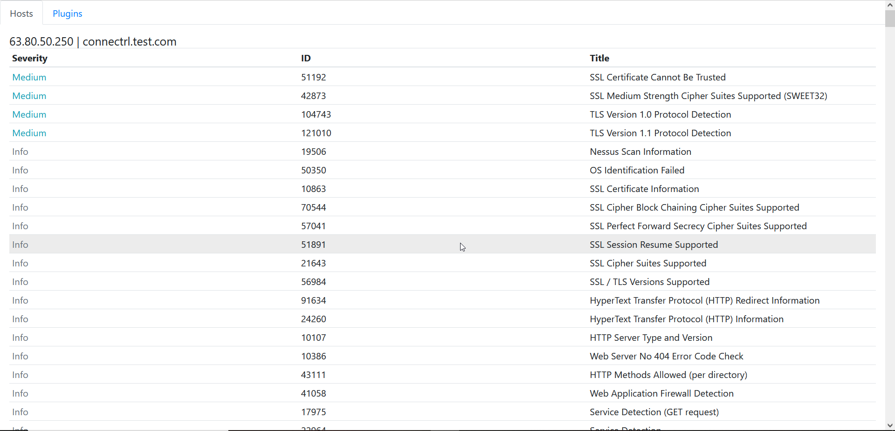
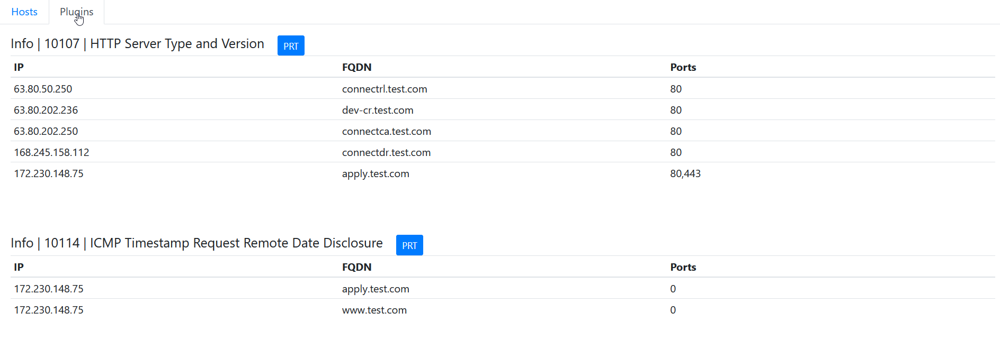

<!-- PROJECT SHIELDS -->
<!--
*** I'm using markdown "reference style" links for readability.
*** Reference links are enclosed in brackets [ ] instead of parentheses ( ).
*** See the bottom of this document for the declaration of the reference variables
*** for contributors-url, forks-url, etc. This is an optional, concise syntax you may use.
*** https://www.markdownguide.org/basic-syntax/#reference-style-links
-->
[![Contributors][contributors-shield]][contributors-url]
[![Forks][forks-shield]][forks-url]
[![Stargazers][stars-shield]][stars-url]
[![Issues][issues-shield]][issues-url]
[![MIT License][license-shield]][license-url]


<!-- PROJECT LOGO -->
<br />
<p align="center">
  <a href="https://github.com/ne0wn/nessusview">
    
    
  </a>

  <h3 align="center">Nessus View</h3>

  <p align="center">
    Parse .nessus files into a readable .html doc
    <br />
    <a href="https://github.com/ne0wn/nessusview"><strong>Explore the docs »</strong></a>
    <br />
    <br />
    <a href="https://github.com/ne0wn/nessusview/issues">Report Bug</a>
    ·
    <a href="https://github.com/ne0wn/nessusview/issues">Request Feature</a>
  </p>
</p>


<!-- TABLE OF CONTENTS -->
<details open="open">
  <summary>Table of Contents</summary>
  <ol>
    <li>
      <a href="#about-the-project">About The Project</a>
      <ul>
        <li><a href="#built-with">Built With</a></li>
      </ul>
    </li>
    <li>
      <a href="#getting-started">Getting Started</a>
      <ul>
        <li><a href="#prerequisites">Prerequisites</a></li>
        <li><a href="#frontend">Frontend</a></li>
        <li><a href="#backend">Backend</a></li>
      </ul>
    </li>
    <li><a href="#usage">Usage</a></li>
    <li><a href="#roadmap">Roadmap</a></li>
    <li><a href="#contributing">Contributing</a></li>
    <li><a href="#license">License</a></li>
    <li><a href="#contact">Contact</a></li>
    <li><a href="#acknowledgements">Acknowledgements</a></li>
  </ol>
</details>


<!-- ABOUT THE PROJECT -->
## About The Project

Nessusview is a pentesters dream when dealing with .nessus files. Simply provide the .nessus file to be parsed, and output name.
A nice, professional, readable parsed .html format will be available for you! 

Also isn't limited to 2500 hosts like the enterprise interface... (NO SHADE)

Now including:
* .html output in a professional format
* hosts tab to view afflictions per host
* plugins tab to view afflicted hosts per vulnerability


<!-- GETTING STARTED -->
## Getting Started

### Prerequisites

Clone the repo
   ```sh

    git clone https://github.com/ne0wn/nessusview.git
    cd nessusview
   ```
Copy / Ensure .nessus file to be parsed is accesible, preferably located
within this applications root directory. It shall be referred to as clientfile

Parse .nessus
```py

    python3 nessusview.py clientfile outputfilename

```

Example:
```py

    python3 Nessusview.py client_external.nessus /work/path/client/client_external_report
    
```
NOTE: .html is added automatically so no need to add above.

<!-- ROADMAP -->
## Roadmap

* Exception Handling
* Input validation, formatting, and cleanup
* Facelift (I'm clearly a noob, help!)
* Written to database for persistence. (Please help!!!!!)


See the [open issues](https://github.com/ne0wn/nessusview/issues) for a list of proposed features (and known issues).


<!-- CONTRIBUTING -->
## Contributing

Contributions are what make the open source community such an amazing place to be learn, inspire, and create. Any contributions you make are **greatly appreciated**.

1. Fork the Project
2. Create your Feature Branch (`git checkout -b feature/AmazingFeature`)
3. Commit your Changes (`git commit -m 'Add some AmazingFeature'`)
4. Push to the Branch (`git push origin feature/AmazingFeature`)
5. Open a Pull Request


<!-- LICENSE -->
## License

Distributed under the MIT License. See `LICENSE` for more information.


<!-- MARKDOWN LINKS & IMAGES -->
<!-- https://www.markdownguide.org/basic-syntax/#reference-style-links -->
[contributors-shield]: https://img.shields.io/github/contributors/ne0wn/nessusview.svg?style=for-the-badge
[contributors-url]: https://github.com/ne0wn/nessusview/graphs/contributors
[forks-shield]: https://img.shields.io/github/forks/ne0wn/nessusview.svg?style=for-the-badge
[forks-url]: https://github.com/ne0wn/nessusview/network/members
[stars-shield]: https://img.shields.io/github/stars/ne0wn/nessusview.svg?style=for-the-badge
[stars-url]: https://github.com/ne0wn/nessusview/stargazers
[issues-shield]: https://img.shields.io/github/issues/ne0wn/nessusview.svg?style=for-the-badge
[issues-url]: https://github.com/ne0wn/nessusview/issues
[license-shield]: https://img.shields.io/github/license/ne0wn/nessusview.svg?style=for-the-badge
[license-url]: https://github.com/ne0wn/nessusview/blob/master/LICENSE.txt
[product-screenshot]: images/home.png
